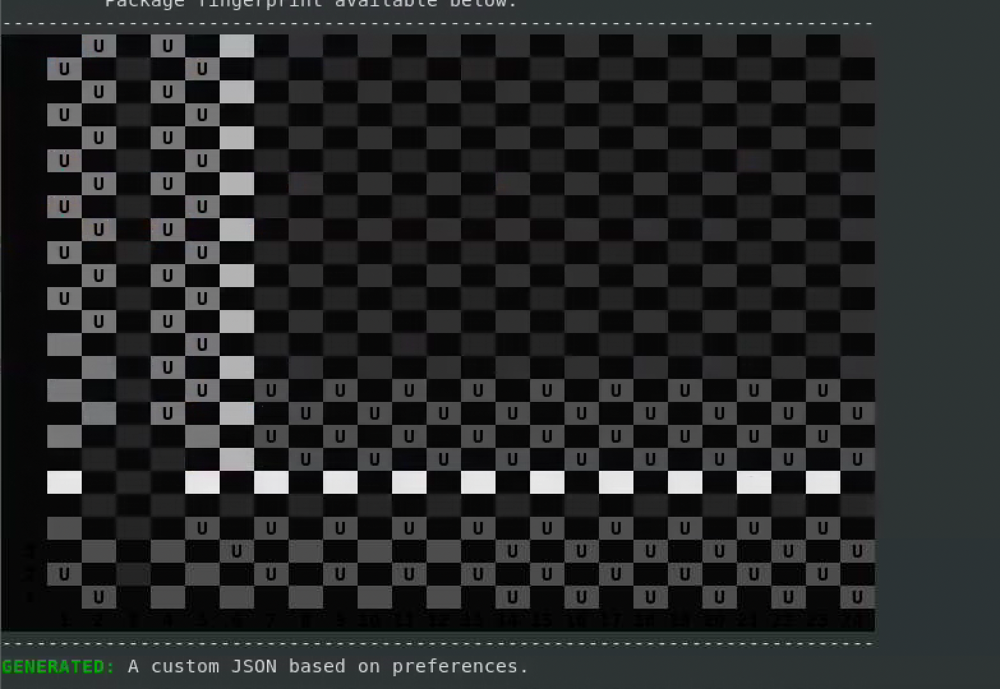

[](https://bwrcrepo.eecs.berkeley.edu/ee290c_ee194_intech22/sp23-chips/-/commits/master)

<details>
<summary>Non-Berkeley students</summary>
<br>

**Please read all of the README, not just this section.**

1. Please clone the repo url provided to you by your instructor or TAs.

2. Depending on your environment, you may not have LSF daemon. As a result, all the <code>bsub -q ee194 -Is</code> should be ignored. As an example:

    -   ```bsub -q ee194 -Is make CONFIG=BearlyConfig buildfile```

    - becomes:

    -   ```make CONFIG=BearlyConfig buildfile```

3. You can ignore all the paths that starts with /tools/C. Instead, you need to find the location of the corresponding file in your setup.

4. We have two different configurations for two chips. You might need to only use BearlyConfig, and in general Bearly as your template. 

5. You may find using auto power config easier for your flow. This would alleviate some P&R dependencies. To make your chip's power configuration automatic, you should edit Bearly.yml or [your-chip-name].yml to include: 

    -   ```"vlsi.inputs.power_spec_mode": "auto"```
    
    - instead of:

    - ```"vlsi.inputs.power_spec_mode": "manual"```

6. For packaging collateral and other Intel provided IPs, refer to sharepoint. You may need to download many of the IPs from sharepoint and add them to the flow. 

7. These are some (not all) the steps of Hammer, for more info and all the available targets, take a look at ```vlsi/build/hammer.d```


</details>

<br>

<details>
<summary>Berkeley students</summary>
<br>

# Pull Request and Merging Rules

1. Avoid staging all the files in the directory by doing either of the below:

    - ```git add .```

    - ```git commit -a -m "comment"```

    Instead, you need to stage the files you want to commit:

    - ```cd $CHIP```

    - ```git status``` will give you unstaged files in red. You can pick the ones you want by:

    - ```git add {path to the file you want to stage}```

    - ```git commit -m "Comment"```

2. Create a self-describing name for you branch: bearly-sp-accel, etc.

3. Create a merge request, and make sure it doesn't introduce conflicts with master. 
    - Getting rid of conflicts is your responsiblity.
    
    - If it does create a conflict, GitLab will tell you to fix them. You should merge master to your branch, resolve conflicts, and then push to your branch again. 


4. Have a description for your merge request.

5. Assign your direct TA as the reviewer.

6. It is a good idea to run synthesis and PAR before you request to make sure your config is synthesis and PAR ready.

</details>

<br>

# Chips
Specifications reside at [Google Drive](https://drive.google.com/drive/u/0/folders/0ABglBdtmxXuZUk9PVA).

Final bump map is [doc](https://docs.google.com/spreadsheets/d/1VHxQTqvIIbLkw8rmBOJwphAG5VL68-MKd1a0Rz1oHeg/edit?usp=sharing).

Bearly Address Map: 
```

	        0 -      1000 ARWX  debug-controller@0
	     1000 -      2000 ARW   boot-address-reg@1000
	     3000 -      4000 ARWX  error-device@3000
	    10000 -     20000  R X  rom@10000
	    20000 -     30000  R XC lbwif-rom@20000
	  2000000 -   2010000 ARW   clint@2000000
	  2010000 -   2011000 ARW   cache-controller@2010000
	  8000000 -   8010000 ARWXC backing-scratchpad@8000000
	  8800000 -   8801000 ARW   dma_device@8800000
	  8801000 -   8802000 ARW   dma_device@8801000
	  8802000 -   8803000 ARW   dma_device@8802000
	  8803000 -   8804000 ARW   dma_device@8803000
	  c000000 -  10000000 ARW   interrupt-controller@c000000
	 10000000 -  10001000 ARW   tile-reset-setter@10000000
	 10001000 -  10002000 ARW   clock-gater@10001000
	 10002000 -  10003000 ARW   clk-sel-ctrl@10002000
	 10003000 -  10004000 ARW   clk-div-ctrl@10003000
	 10004000 -  10004800 ARW   ringpll-ctrl@10004000
	 10010000 -  10011000 ARW   GPIO@10010000
	 10011000 -  10012000 ARW   GPIO@10011000
	 10012000 -  10013000 ARW   GPIO@10012000
	 10013000 -  10014000 ARW   GPIO@10013000
	 10020000 -  10021000 ARW   serial@10020000
	 10021000 -  10022000 ARW   serial@10021000
	 10022000 -  10023000 ARW   serial@10022000
	 10030000 -  10031000 ARW   QSPI@10030000
	 10031000 -  10032000 ARW   QSPI@10031000
	 10032000 -  10033000 ARW   QSPI@10032000
	 10040000 -  10041000 ARW   i2c@10040000
	 10041000 -  10042000 ARW   i2c@10041000
	 10050000 -  10051000 ARW   prefetcher@10050000
	 10060000 -  10061000 ARW   pwm@10060000
	 10061000 -  10062000 ARW   pwm@10061000
	 20000000 -  30000000 ARWX  QSPI@10030000
	 40000000 -  50000000 ARWX  QSPI@10031000
	 80000000 - 480000000 ARWXC memory@80000000

```


RoboChip Address Map:

```
Generated Address Map
	        0 -      1000 ARWX  debug-controller@0
	     1000 -      2000 ARW   boot-address-reg@1000
	     3000 -      4000 ARWX  error-device@3000
	    10000 -     20000  R X  rom@10000
	    20000 -     30000  R XC lbwif-rom@20000
	  2000000 -   2010000 ARW   clint@2000000
	  2010000 -   2011000 ARW   cache-controller@2010000
	  8000000 -   8010000 ARWXC backing-scratchpad@8000000
	  c000000 -  10000000 ARW   interrupt-controller@c000000
	 10000000 -  10001000 ARW   tile-reset-setter@10000000
	 10001000 -  10002000 ARW   clock-gater@10001000
	 10002000 -  10003000 ARW   clk-sel-ctrl@10002000
	 10003000 -  10004000 ARW   clk-div-ctrl@10003000
	 10004000 -  10004800 ARW   ringpll-ctrl@10004000
	 10010000 -  10011000 ARW   GPIO@10010000
	 10011000 -  10012000 ARW   GPIO@10011000
	 10012000 -  10013000 ARW   GPIO@10012000
	 10020000 -  10021000 ARW   serial@10020000
	 10021000 -  10022000 ARW   serial@10021000
	 10022000 -  10023000 ARW   serial@10022000
	 10030000 -  10031000 ARW   QSPI@10030000
	 10031000 -  10032000 ARW   QSPI@10031000
	 10032000 -  10033000 ARW   QSPI@10032000
	 10040000 -  10041000 ARW   i2c@10040000
	 10041000 -  10042000 ARW   i2c@10041000
	 10060000 -  10061000 ARW   pwm@10060000
	 10061000 -  10062000 ARW   pwm@10061000
	 20000000 -  30000000 ARWX  QSPI@10030000
	 30000000 -  40000000 ARWX  QSPI@10031000
	 80000000 - 480000000 ARWXC memory@80000000
```


BealryML 2023  

RoboChip 

RoboChip with switched capacitor 


# ECO flow
0. To fix antenna violations: 

```
    create-diode -diode_cell b15ydp151an1n03x5 -pin (target endpoint inst) (target endpoint pin) 
    set_db eco_refine_place true
    set_db place_detail_preserve_routing true
    place_eco -fix_placed_insts true -use_spare_cells true
    set_dont_touch inst:MyDiodeInst true
    route_eco
```

# Signoff flow
0. After a successful chip top PAR, you will need to run par-to-drc: 

    ```bsub -q ee194 -Is make CONFIG={config} par-to-drc-ChipTop```

1. To run fill:
 
    ```bsub -q ee194 -Is make CONFIG={config} HAMMER_DRC_TARGET=drc-ChipTop fill```

2. To run drc after fill: 

    Final-drc will run all the decks using the ChipTop_fill.gds which is the filled version of the design.

    ```bsub -q ee194 -Is make CONFIG=BearlyConfig HAMMER_DRC_TARGET="drc-ChipTop" FRAME_2x2=YES drc-final```

    This command should run the final decks on the filled gds. It will also include the waiver files for the waived drcs.

3. To create submission ready files: 

    ```bsub -q ee194 -Is make CONFIG={config} HAMMER_DRC_TARGET="drc-ChipTop" submit-2x2```

    This command will create a 2x2-submission directory in your build directory. You can submit a zipped version of this to Intel.


# DRC State
Please keep this doc updated:
[DRC STATE](https://docs.google.com/document/d/1PLGUmvgYiQyZrajm33prEhHTEPFc4CLwDcH6kk8idTE/edit?usp=sharing)

# Tapeout Wiki
The Wiki is hosted at [Link](https://sites.google.com/berkeley.edu/tapeoutsp23privatewiki/home).

# After a Submodule Merge
Some teams have their implementation as a submodule (Kalman filter team or SPAccel team). These submodules will be added as a dependency to build.sbt and .gitmodules file. After a pull from master, you will get an error that some class is missing. To resolve this, you need to install the submodule corresponding to the team by:
 
- ```cd $CHIP```

- Delete all the stale custom submodules in generators and get their latest version:
    ```
    cd generators
    rm -rf bar-prefetchers/ bearly-near-mem/ gps kalman/ lqr-rocc/ sp-accel sp-accel-reserve/
    cd ..
    ./scripts/init-submodules-no-riscv-tools.sh
    ```
    


# First Time Setup

1. Clone this repo and set a variable for the chip directory path:


    ```git clone git@bwrcrepo.eecs.berkeley.edu:ee290c_ee194_intech22/sp23-chips.git chip ```

    ```cd chip```

    ```export CHIP=$(pwd)```

    Note: it is a best practice and part of BWRC compute policy to keep your directories organized, safe and clean. On that note, it is recommended to make your directory not accessible or executable for the rest of the BWRC users since others might not have access to technology specific. To do so, you may run the ```chmod``` commnad on your directory. Please refer to the man pages for ```chmod``` for further information. 


    ```chgrp intech22 chip```

    ```chmod 2750 chip```


2. Activate a base conda environment (and source commercial licenses, etc.): 

    ```source /tools/C/ee290-sp23/ee290-tools-env.sh```

    After the above command you conda env should be the base conda environment. 

    You can check this by doing:

    ```conda env list ```

2. Change directory to the sp23-chips:

    ```cd  $CHIP```

3. Run the build setup but skip FireSim and Marshal by (this step takes a long time!): 

    ```bsub -q ee194 -Is $CHIP/build-setup.sh riscv-tools -s 6 -s 7 -s 8 -s 9```

    The above will ask you that you are not on the latest release of chipyard, answer 'y' to that. 


4. Set the riscv environment for Chipyard

    ```source $CHIP/env.sh```


5. Get the VLSI plugins and update to the latest versions, and update your hammer-vlsi:

    ```$CHIP/scripts/init-vlsi.sh intech22```


6. Go to the VLSI directory and buld the bump map:

    ```cd vlsi```

    ```bsub -q ee194 -Is make CONFIG=BearlyConfig buildmap```

    you should be seeing a generated bump map:

    
7. Make the design, in case it didn't build:

    ```bsub -q ee194 -Is make CONFIG=BearlyConfig buildfile```

8. Synthesize RocketTile:

    ```bsub -q ee194 -Is make CONFIG=BearlyConfig syn-RocketTile```


    If you are seeing a ruamel problem after synthesis, you should perform an upgrade to hammer-vlsi:

    ```pip install hammer-vlsi --upgrade```

9. Syn-to-par RocketTile:
    ```bsub -q ee194 -Is make CONFIG=BearlyConfig syn-to-par-RocketTile```


10. par-RocketTile: 

    ```bsub -q ee194 -Is make CONFIG=BearlyConfig par-RocketTile```


11. You have successfully synthesized and ran PAR for the Rocket block.

# New Session
Every time you have a new ssh session or you logged out of NoMachine (closing the NoMachine window keeps your sesssion), you should:

```source /tools/C/ee290-sp23/ee290-tools-env.sh```

Change directory to your chip and:

```source env.sh```

The env.sh activates your previously created conda environment. 

# DRC Per Block Flow

1. First you need to finish PAR on a block, for instance, par-RocketTile

2. Generate the input json for DRC run:
    - ```bsub -q ee194 -Is make CONFIG=BearlyConfig par-to-drc-{blockname}```
    - For example: 

    - ```bsub -q ee194 -Is make CONFIG=BearlyConfig par-to-drc-RocketTile``` or ```par-to-drc-backingscratchpad```

3. To perform DRC on this block only:
    - ```bsub -q ee194 -Is make CONFIG=BearlyConfig HAMMER_DRC_TARGET="drc-{blockname}" drc-block```
    - For example:
    - ```bsub -q ee194 -Is make CONFIG=BearlyConfig HAMMER_DRC_TARGET="drc-RocketTile" drc-block```

This will run all the drc decks on this one block. 

5. If you modify your placements or redo-par and would like to redo-drc, you need to clean the drc decks that you ran first by:

    - ```bsub -q ee194 -Is make CONFIG=BearlyConfig HAMMER_DRC_TARGET=drc-{blockname} clean-drc```
    - This will get rid of the old directories for drc decks
    - Now you should be able to run drc again
    - ```bsub  -q ee194 -Is make CONFIG=BearlyConfig HAMMER_DRC_TARGET=drc-{blockname} drc-block```


6. Per block "drc-block" target would run all the Intel DRC decks on the block:

| Flow Name | Description                                                                                         |
|-----------|-----------------------------------------------------------------------------------------------------|
|drcd       | Base, Metal and Via layer design rule checks                                                        |
|drc_IPall  | In process charging checks                                                                          |
|drc_IL     | Checks for illegal layer usage. Also checks for grid check rules.                                   |
|drc_LU     | Latchup and IO checks                                                                               |
|drc_TUC    | Template usage checks                                                                               |
|denall     | Used to certify and check Local and Concentrated Local Metal Density Checks, global density checks  |

# LVS Per Block Flow
0. update your Hammer version by running:
    ```
    cd $CHIP
    cd scripts
    ./update-hammer.sh
    ```
1. First you need to finish PAR on a block, for instance, par-RocketTile
2. Generate the input json for LVS run:
    - ```bsub -q ee194 -Is make CONFIG=BearlyConfig par-to-lvs-{blockname}```
    - For example: 

    - ```bsub -q ee194 -Is make CONFIG=BearlyConfig par-to-lvs-RocketTile``` or ```par-to-lvs-backingscratchpad```

3. To perform LVS on this block only:
    - ```bsub -q ee194 -Is make CONFIG=BearlyConfig HAMMER_LVS_TARGET="lvs-{blockname}" HAMMER_DRC_TARGET="drc-{blockname}" lvs-block```


5. If you modify your placements or redo-par and would like to redo-lvs, you need to clean the lvs that you ran first by:

    - ```bsub -q ee194 -Is make CONFIG=BearlyConfig HAMMER_LVS_TARGET=lvs-{blockname} HAMMER_DRC_TARGET="drc-{blockname}" clean-lvs```
    - This will get rid of the old directories for lvs decks
    - Now you should be able to run lvs again


# Changing Placements and Floorplan
1. We are putting all the placment constraints in Bearly.yml and Robo.yml
2. If you are adding a block, for example L2 caches, you need to specify the block name as a child of ChipTop in Bearly.yml
    - For instance:

    ```
        vlsi.inputs.hierarchical:
        mode: hierarchical
        top_module: ChipTop
        config_source: manual
        manual_modules:
            - ChipTop:
                - RocketTile
    ```
3. Within the placement constraints you find ChipTop and its child blocks. You also find the hierarchical blocks. Use the already existing Rocket block as an example.

# Changing Chip Configs
1. To change the config that Chipyard uses to generate the source code, you need to change: 
    - ```chip/generators/chipyard/src/main/scala/config/ChipConfig.scala```
    - There are two different configurations for Robo and Bearly

2. Once you modify the config, you need to generated the source again:
    - ```bsub -q ee194 -Is make CONFIG=BearlyConfig buildfile```

# Adding IPs
1. To add IPs, for instance Intel clock receiver, we need to provdie:
    - [design_ip].gds file
    - [design_ip].lib file
    - [design_ip].lef file
2. You need to add them as extra libraries to Bearly.yml or Robo.yml

3. As a guideline, you may refer to   ``` vlsi/Bearly.yml``` file, and search for ```extra_libraries```

4. To place the IP, you need to specify the placement constraint in Bearly.yml or Robo.yml as well. Take a look at die_ring in Bearly.yml


# Adding Submodules
1. First you need to add your submodule as a git submodule, 
    - ```git submodule add <remote_url> <destination_folder>```

    example

    - ```git submodule add git@github.com:ucb-bar/gemmini.git generators/gemmini```

    - This would add a pointer to your submodule to the .gitmodules file

    - After that you need to ```git submodule sync``` and finally run ```./$CHIP/scripts/init-submodules-no-riscv-tools.sh```


2. To add your project as a submodule to this repo, you need to modify ```build.sbt``` in the CHIP directory. 
    - As an example for gemmini:

    ```
    lazy val chipyard = (project in file("generators/chipyard"))
        .dependsOn(testchipip, rocketchip, boom, hwacha, sifive_blocks, sifive_cache, iocell,
            sha3, // On separate line to allow for cleaner tutorial-setup patches
            dsptools, `rocket-dsp-utils`,
            gemmini, icenet, tracegen, cva6, nvdla, sodor, ibex, fft_generator,
            constellation, mempress)
        .settings(libraryDependencies ++= rocketLibDeps.value)
        .settings(commonSettings)
    ```

    and 

    ```
    lazy val gemmini = (project in file("generators/gemmini"))
        .dependsOn(testchipip, rocketchip)
        .settings(libraryDependencies ++= rocketLibDeps.value)
        .settings(chiselTestSettings)
        .settings(commonSettings)
    ```

# Redo PAR Only
In cases described below, you should only perform redo-par step:

1. If your source (verilog file, Chipyard config, Chisel source) did not change, there is no need to synthesize the design (any of the blocks or chiptop) again.

2. If you have changed the physical aspect only such as integrated a physical design, changed the coordinates, sizes, bump assignment, etc. 

To do so:
- ```bsub -q ee194 -Is make CONFIG=BearlyConfig redo-par-{block} HAMMER_EXTRA_ARGS="-p Bearly.yml"```

Example for RocketTile:

- ```bsub -q ee194 -Is make CONFIG=BearlyConfig redo-par-RocketTile HAMMER_EXTRA_ARGS="-p Bearly.yml"```

# Hammer/Innovus PAR steps
You may add a Hammer hook to (before/after) the stptes below:

1. init_design
2. floorplan_design
3. place_bumps
4. place_tap_cells
5. power_straps
6. place_pins
7. place_opt_design
8. clock_tree
9. add_fillers
10. route_design
11. opt_design

You should place hammer hooks in ```vlsi/ee290-vlsi``` python file. Please refer to [Hammer Doc](https://hammer-vlsi.readthedocs.io/en/stable/Hammer-Use/Hooks.html#including-hooks) for how to add hooks.


# Common Questions
1. Make sure you activate the Chipyard conda environment before you run any of the commands every time you start a new terminal or else you might see an error message similar to below:

    ```*** RISCV is unset. Did you source the Chipyard auto-generated env file (which activates the default conda environment)?.```

    <code>cd $CHIP<br>
    conda activate .conda-env</code>

2. Make sure you run buildmap before running buildfile. This is so that the buildmap script generates the yaml file for Hammer.

3. To change the placement of blocks and macros, modify ```$CHIP/vlsi/Bearly.yml``` or ```$CHIP/vlsi/Robo.yml```

4. When running any of the make commands, you should always include the corresponding chip config i.e. ```make CONFIG=BearlyConfig ...```

5. In case you changed a placement or some physical aspect of the design, redo-par can be done without re-doing every step of the flow:

    - ```make CONFIG=BearlyConfig redo-par-ChipTop HAMMER_EXTRA_ARGS="-p Bearly.yml"```

    - ```make CONFIG=RoboConfig redo-par-ChipTop HAMMER_EXTRA_ARGS="-p Robo.yml"```

    - The redo-par can be done on sub-blocks as well:

    - ```make CONFIG=BearlyConfig redo-par-RocketTile HAMMER_EXTRA_ARGS="-p Bearly.yml"``` 

6. To change the bump assignment, you need to edit ```$CHIP/vlsi/hammer-bump-plugin/scripts/src/BearlyUtilDriver.py``` or ```RoboUtilDriver.py```

# Merge Conflicts

There is a high chance that you would get merge conflicts since there are many active branches and at anytime there may be a merge to master. 

Here I pulled master and got a merge conflict right after I pulled:


<code>
    From bwrcrepo.eecs.berkeley.edu:ee290c_ee194_intech22/sp23-chips
    * branch              master     -> FETCH_HEAD
    Auto-merging vlsi/Bearly.yml
    CONFLICT (content): Merge conflict in vlsi/Bearly.yml
    Automatic merge failed; fix conflicts and then commit
</code>

Notice the file that caused the merge conflict is the file that I modifed prior to this pull, and the latest commit on the repo had conflicting chnages to the same lines. You would get an indication simliar to below:

```<<<<<<< HEAD
=======
>>>>>>> 7e61ea828bbdb45eb3d820825caee36eaa49192a
```

This means that your local repo (HEAD pointer) has the content from HEAD to "=====", and the incoming chnages have the content from "=====" to the ">>>> hash". 

To resolve the conflict, you need to manually pick one of the options or performa a mix update of some of the lines from HEAD and some from the remote repo.

Once you add the file, you can commit your changes.
