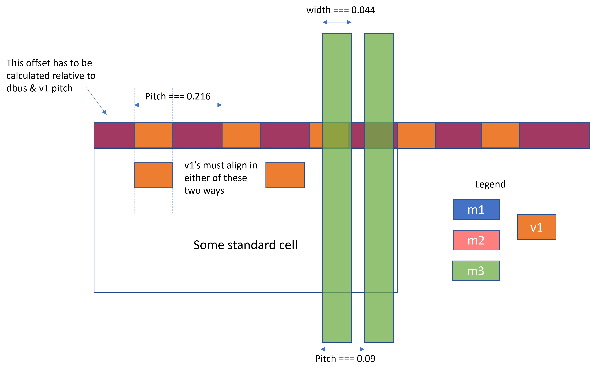

intech22: Intel 22 FFL Technology Library for HAMMER
===================

This is the Intel 22 FFL technology library for HAMMER.

The configuration for this library can be found in `intech22/defaults.yml`. For more information about the underlying configuration, see ucb-bar/hammer.

# TECH-SPECIFIC HOOKS
Tech-specific hooks are supplied for Innovus & Calibre DRC. They are in `par/innovus/__init__.py` and `drc/calibre/__init__.py` respectively and are imported into `intech22/__init__.py`.

# FLOORPLAN & POWER STRAPS

- The core bounding box (die size - margins) height must be a multiple of **1.26um**. This is required due to double-height tap cells and associated power straps hacks (see default `intech22_create_sites` & `intech22_m2_staples` hooks).
- The core width may snap to a multiple of placement width (1.08um). You can `set_db floorplan_snap_die_grid manufacturing` to get around this limitation.
- You must use the included `intech22_m2_staples` hook and not use Hammer's power straps API for layers below m3. This is required to satisfy the power metal/via rules for m3 and below (see the figure below for details)
- Ensure that the m3 power grid does not draw over well taps, or else v2's will not be generated. The default well tap interval is set to be a multiple of 1.8um.
- M1-M6 have quantized widths and max width. You cannot exceed `track_width: 10` up to M6 for example.
- Be careful when specifying top layer power straps to not exceed density rules.
- If you place power straps on m8, be sure to not make your v7 density high enough such that SmartFill cannot fill the ce1 & ce2 layers. ce1/ce2 layer global (not windowed) density must be >50%.
- Note: if you have any blocks in your design that connect to bumps (analog stuff w/ ESD diodes), the `intech22_tap_cells` hook no longer automates latchup tap cell placement for you. You will need to manually place placement blockages to avoid latchup violations.




# TAPE-IN COLLATERAL 

## DIE RINGS, BUMPS

Refer to `/tools/intech22/PDK/$PDK_VERSION/doc/Intel_P1222_29_PDK_User_Guide_<PDK_VERSION>.pdf` for details about how to use the tape-in collateral.
Refer to `/tools/intech22/doc/22FFL_Logic_PDK_UCB.pdf` page 182 for DRC rules for die size, edge-of-active (EOA), and etch ring.

Currently, there are two active package options for University Shuttle Program users:
 `uni2_4x4_c4_er_edm_prs_top` and `uni2_2x2sub4x4_c4_er_edm_prs_top`. The former is a 4x4 package and the latter is a 2x2 package. 
To instantiate a die ring template:
- Create a Hammer physical placement constraint (`create_physical: true`) with the `master` name being the template you wish to instantiate and `type: overlap`.
- The `intech22_extra_layers` hook instantiates an Edge of Active (EOA, stream layer 81.29) rectangle aligned with the boundary between the Etch Ring (ER) and Edge Damage Monitor (EDM) cells. The offsets vary depending on the package.
- The `intech22_extra_layers` hook also places GLOBALFILLKOR over ER, EDM, & PRS cells, and deletes route blockages for SmartFill. In order for GLOBALFILLKOR to be placed, it is necessary to instantiate the die ring according to the prior step.
- EDM cells are further offset 3.24um x 3.78um from the EOA boundary
- Two Pattern Recognition System cells, PRS-U and PRS-H, occupy the bottom left and top right corners of the core area, respectively and are 58.32um x 57.96um inside the EDM boundary

Bumps (non-EMIB):
- 2 bump cells: c4b (55um) and c4fcbga (85um). Currently, c4b is the default for the technology.
- c4 is the bump layer, tv1 is the via layer down to M8
- Bump pitch is decided by Intel and cannot be modified. X and Y bump pitches are not the same.
- c4b bumps have a single gv1 via from c4 to gmb where routing may begin. It is advisable not to route straps on gmb unless a custom hook has been written.
- Min 75um space from bump center to EOA
- The ATD FIELD tool is nominally required for final bump design sign-off

Flip chip routing:
- A basic auto-routing hook is provided in this plugin (`intech22_fc_route`) with settings that can maximize the chance of DRC-clean RDL routing. It is likely you will need to make a custom hook with pairwise bump/IO cell assignments.

## PAD FRAME (IO CELLS)

Refer to `/tools/intech22/doc/PADLIB/P1222.11DP1.0 IO Integration Guidelines.pdf` for more details on IO cells.

Below rules assume ring IO structure. Area IO requires verification in RapidESD tool.
- `_e1` cells are for top/bottom sides of ring, `_n1` cells are for left/right of ring
- Orientation is critical! `e` cells need to be `my` on the right edge, `n` cells need to be `mx` on the bottom edge.
- N/S ring width & spacing MUST be a multiple of **2.16um**. N/S IO cells are 47.88um tall (76 sites).
- E/W ring height & spacing MUST be a multiple of **2.52um**. E/W IO cells are 45.36um wide (420 sites).
- The ring should clear the die ring + satisfy >=2um M8 spacing. Thus, recommended IO ring margins are at least 77.76um (L/R) and 78.12um (T/B)
- The P&R core area should like within the IO ring, satisfy spacing, and be a multiple of the site dimensions. Thus, recommended core margins are at least 125.172um (L/R) and 128.52um (T/B) 
- Maximum ~170um between two supply clamps (4 pads w/o spacers, but pads need to be spaced out if using the flip chip router)
- Minimum 18 supply clamps in 1V8 domain per ring, 3 supply clamps in 1V0 domain per ring
- In order to have spacers fill the entire space, you must have an even number of supply cells on each edge
- Each domain needs to be capped by a `ring_terminator` if it is not a full ring. Be careful of orientation--the terminators on opposite ends of an area I/O need to be facing each other!

Supplies (CPF):
- vcc = core supply, vccio = IO supply, vssb = core ground, vssp = IO ground (connect in CPF)
- No special nets required in CPF because the trigger logic is included in the supply clamp cells. Example:

```
create_power_nets -nets VDD_1P8 -voltage {1.7:1.85}
create_global_connection -domain AO -net VDD_1P8 -pins VDD_1P8
```

Innovus IO file:
- Can directly instantiate the corner & supply cells.
- All cells must be forced to have an orientation due to bad LEFs.
- Example with clock, reset, JTAG, and 2 interrupts. Cells are placed adjacent to each other:

```
(globals
    version = 3
    io_order = clockwise
)
(row_margin
    (left
    (io_row ring_number = 1 margin = 77.76)
    )
    (right
    (io_row ring_number = 1 margin = 77.76)
    )
    (top
    (io_row ring_number = 1 margin = 78.12)
    )
    (bottom
    (io_row ring_number = 1 margin = 78.12)
    )
)
(iopad
    (bottomleft
        (inst name="iocell_corner_ll"   orientation=MX    cell="corner_nw1" )
    )
    (bottomright
        (inst name="iocell_corner_lr"   orientation=R180  cell="corner_nw1" )
    )
    (topleft
        (inst name="iocell_corner_ul"   orientation=R0    cell="corner_nw1" )
    )
    (topright
        (inst name="iocell_corner_ur"   orientation=MY    cell="corner_nw1" )
    )
    (left
    (locals ring_number = 1)
        (inst name = "iocell_sup_1"     orientation=R0 cell="sup1v8_e1" ) 
        (inst name = "iocell_clock"     orientation=R0 ) 
        (inst name = "iocell_reset"     orientation=R0 ) 
        (inst name = "iocell_sup_2"     orientation=R0 cell="sup1v8_e1" ) 
        (inst name = "iocell_jtag_TCK"  orientation=R0 ) 
        (inst name = "iocell_jtag_TMS"  orientation=R0 ) 
        (inst name = "iocell_sup_3"     orientation=R0 cell="sup1v8_e1" ) 
        (inst name = "iocell_jtag_TDI"  orientation=R0 ) 
        (inst name = "iocell_jtag_TDO"  orientation=R0 ) 
        (inst name = "iocell_sup_4"     orientation=R0 cell="sup1v8_e1" ) 
    )
    (right
    (locals ring_number = 1)
        (inst name = "iocell_sup_5"     orientation=MY cell="sup1v8_e1" ) 
        (inst name = "iocell_interrupt/bit_0" orientation=MY ) 
        (inst name = "iocell_sup_6"     orientation=MY cell="sup1v8_e1" ) 
        (inst name = "iocell_interrupt/bit_1" orientation=MY ) 
        (inst name = "iocell_sup_7"     orientation=MY cell="sup1v8_e1" ) 
        (inst name = "iocell_sup_8"     orientation=MY cell="sup1v8_e1" ) 
    )
    (top
    (locals ring_number = 1)
        (inst name = "iocell_sup_9"     orientation=R0 cell="sup1v8_n1" ) 
        (inst name = "iocell_sup_10"    orientation=R0 cell="sup1v8_n1" ) 
        (inst name = "iocell_sup_11"    orientation=R0 cell="sup1v8_n1" ) 
        (inst name = "iocell_sup_12"    orientation=R0 cell="sup1v8_n1" ) 
        (inst name = "iocell_sup_13"    orientation=R0 cell="sup1v8_n1" ) 
    )
    (bottom
    (locals ring_number = 1)
        (inst name = "iocell_sup_14"    orientation=MX cell="sup1v8_n1" ) 
        (inst name = "iocell_sup_15"    orientation=MX cell="sup1v8_n1" ) 
        (inst name = "iocell_sup_16"    orientation=MX cell="sup1v8_n1" ) 
        (inst name = "iocell_sup_17"    orientation=MX cell="sup1v8_n1" ) 
        (inst name = "iocell_sup_18"    orientation=MX cell="sup1v8_n1" ) 
    )
)
```

Here is an example hook to be included post `floorplan_design`:

```
def io_placement(x: hammer_vlsi.HammerTool) -> bool:
    x.append('''
read_io_file {io_file} -no_die_size_adjust
connect_global_net VDD_1P8 -type pg_pin -pin_base_name vccio -verbose
connect_global_net VSS -type pg_pin -pin_base_name vssp -verbose
connect_global_net VSS -type pg_pin -pin_base_name vssb -verbose
'''.format(io_file=x.get_setting("<your_io_file>")))
    return True
```

IO fillers are handled by the `intech22_io_fillers` hook supplied in this tech plugin.

Basic auto-flip chip routing is available in the `intech22_fc_route` hook supplied in this plugin.

## DROP-IN COLLATERAL (DIC) & INTRA-DIE VARIATION PROBE (IDVP) CELLS
Refer to `/tools/intech22/doc/22FFL_Full_Chip_UCB.pdf` for more details on DIC & IDVP cells.

Drop-in collateral is functionally similar to fiducials in other technologies. There are 3 types:
- Reg (`b88xdicregx6000xx2ulx`) occupies layers up to m6, is 3.24um x 2.52um
- CD (`b88xdiccd0x6000xx2ulx`) occupies layers up to m6, is 3.24um x 2.52um
- Poly-Scat-ID (`b88xdicplyxi000xx4ulx`) is just an ID layer, no blockages necessary

You MUST use BOTH `fdk22tic4m1_diccd_cont` and `fdk22tic4m1_dicreg_cont` cell in the design. Rules are:
- Blockage must be placed thru m6
- Minimum 4 cells in top-level die
- Cells must not abut or overlap (1.08um x 1.26um min space)
- Max. 400um from die edge
- Max. 1250um between cells

It is recommended to place this cell as a physical-only Hammer placement constraint in the top-level module.
If using hierarchical flow, there is a CalibreDRV script in the tapein deck that will de-uniquify references to this cell if they are placed in lower levels of the P&R hierarchy. This is necessary because the FullChip DRC deck checks for the exact cell name.

IDVP is required to measure within-die variation. They are connected with a daisy chain and measured using Test Access Port (TAP) collateral. For majority-digital designs, the `b70shipidvcmb108umifm4` cell should be placed uniformly around the die. Refer to the Full-Chip document for placement guidelines.

## ESD/LU
Refer to `/tools/intech22/doc/22FFL_ESD_LU_UCB.pdf` for more details about ESD.

- It is recommended to use the `fdk22b82lto_b88xesdclpn6000qnxcnx` power clamp. Connect the `vcc_nom` net to your global power net.
- Ensure that you do not have floating bumps and I/O cells are hooked up correctly to power bumps. If using the flip-chip router, it may not connect to all power rings in the I/O ring. To fix this, you can do this:

    ```
    # VSS -> vssb & vssp
    select_routes -layer m8 -nets VSS -shapes iowire
    edit_stretch_routes x -44 high
    edit_stretch_routes x 46 high
    deselect_routes
    ```

- The `intech22_well_taps` hook should handle well taps near latchup zones 

## TOP-LEVEL HOOKS & CONFIG
In conclusion, this is an example of what to put in your <project>-vlsi entry script for the chip-level module (pad frame, bumps):

```
intech22_innovus = __import__('hammer-intech22-plugin.par.innovus', fromlist=['*'])

class ProjectDriver(CLIDriver):
    def get_extra_par_hooks(self) -> List[HammerToolHookAction]:
        extra_hooks = [
            hammer_vlsi.HammerTool.make_post_insertion_hook("floorplan_design", io_placement),
            hammer_vlsi.HammerTool.make_post_insertion_hook("io_placement", intech22_innovus.intech22_io_fillers),
            hammer_vlsi.HammerTool.make_post_insertion_hook("place_bumps", intech22_innovus.intech22_fc_route),
        ]
        return extra_hooks 
```

# CLOCK ROUTING

The Intel Reference Flow provided special non-default routing rules for the clock tree. The `technology.intech22.ndr` option can be `shield`, `no shield`, or blank to select what routing rules to use for the clock tree.

Refer to the supplied `intech22_cts_options` hook to see what these rules are.

# SIGNOFF (FILL, DRC, LVS)
Refer to `/tools/intech22/PDK/$PDK_VERSION/doc/Intel_P1222_29_PDK_User_Guide_<PDK_VERSION>.pdf` for more details about the signoff flow.

- Mentor Calibre and Synopsys ICV are supported
- ICV is recommended to run DRC (Calibre DRC decks will give erroneous violations)
- LVS may be run with either tool
- Call the `fill` target for FEOL & BEOL fill.
- Call the `drc-block` and `lvs-block` targets to run all decks at the block level
- Call the `drc-chip` and `lvs-chip` targets to run all decks at the chip level, pre-fill
- Call the `signoff` target to run fill, tapein merge, and all chip-level decks
- Hierarchical DRC/LVS is also handled by the included Makefiles if `HAMMER_DRC_TARGET` and `HAMMER_LVS_TARGET` variables are set.
- The Make targets are correctly ordered to handle `-jN` parallel execution
- If you are using cells without GDSs, you must set the `SRAM_NO_GDS` variable. This prevents Calibre from erroring on the missing reference (great for debugging but not suitable for tapeout).
- There is a GDS deuniquification script that is run in order for the decks to properly identify DICs, and ESD cells that were placed hierarchically. This is run before fill/DRC decks. If you need to deuniquify any other additional cells (e.g. clamp/diode wrappers, SRAM cells), you should append to the `CELLS_TO_DEUNIQUIFY` Make variable.
- If submitting a 2x2 aggregation, calling `submit-2x2` will prepare submission databases. Note that the standard signoff flow will not work for the aggregation.

## Calibre
You must include the provided `signoff/calibre.mk` into your vlsi Makefile.
There are many Calibre DRC decks that need to be run (refer to the make targets).
The `view_gds` script generated by Hammer will open up the layout & violations in CalibreDRV.
Notes:
- Ignore the `missing_top_cellboundary` DRC violation unless you have run fill.
- TODO: the PRS utility currently does not get a rotated (gate direction horizontal) database.
- TODO: profile deck runtime to optimize ordering given -j flag.
- TODO: find out if this deck also needs deuniquification script to be run.

## ICV
You must include the provided `signoff/icv.mk` into your vlsi Makefile.
There are many ICV DRC decks that need to be run (refer to the make targets).
The `view_gds` script generated by Hammer will open up the layout & violations in IC Validator WorkBench
Notes:
- IMPORTANT: It is recommended that your top-level supplies are `vcc*` and `vss`. If they are not, you will need to copy the runset directory locally, then modify `proj_config/UserDefines.rs` so that the supplies in there match your design's, and then override the defaults for `drc.icv.includes` and `lvs.icv.includes` because those variables cannot be set with `#define`s. Refer to the Guidebook for details about each one of those variables.
- `-j2` and `-j4` will yield optimal runtimes on relatively clean designs.
- If you have analog macros which may have different versions of the same cell name and are doing hierarchical flow, the ordering of your libraries matter for LVS. You should put cells used later in the flow (i.e. higher level of hierarchy) earlier in the list of `extra_libraries`. The other alternative is to make sure none of the cells in your analog macros are identical (e.g. by prefixing the library to the cell name).

## VIOLATION TIPS/WAIVERS
- **If using the Intel-provided 2x2 corner die frame, you must run all DRC Make targets with the environment variable `FRAME_2x2` defined to something.**
- `M#_300`: If using shielded clocks, only specific power strap widths can be used.
- `M1_51/52/53`: m1 & m2 straps likely too close to SRAMs. Recommended to add to your own hook: `create_route_blockage -layers {m1 m2} -pg_nets -rects [get_computed_shapes [get_db [get_db insts *ext/mem_*_*] .bbox] SIZE 0.54]`. Will remove other m1/v1 violations also. Occasionally, m3 & m4 also violate.
- Check for power straps at hierarchical boundary edges. Will cause min end-to-end space violations.
- Illegal layer NVM: make sure deuniquification script is run 
- `DI_*`: If spacing rules are satisfied, ignore until tapein deck is run (same reason as above).
- `DC_*`: likely due to DiffGridCheck shapes not lining up. Make sure all macros are placed on multiple of 0.09 in y-dim. Don't just abut SRAMs vertically (their heights are not multiples of 0.09) or sometimes horizontally (DiffCheckGrid too short in between)!
- `DT_*`: BasepitchID errors can come from terminator cells on either end of a row of IO cells not being mirrored properly, auto-placement of io fillers between some macros that are outside the the core bbox, and bad place blockages that cause filler cells to make corners with edges <2um.
- `*UV_*`: will appear until UV fill (special metal fill deck)
- `LU_57/58/61/63`: Make sure you don't have anything within latchup zone C. Tap cells must be fully placed as per zone D & zone E requirements. Finally, macros usually cannot be in any macro zone unless the internally have lots of tap cells/guard rings.
- `SB_01, SB_02, SB_03, SB_05`: waive these single bump violations
- `PL_92, BU_22, MC_101`: waive
- `VD_10#`: waive via density errors

# OTHER RULES/KNOWN ISSUES
- Refer to `/tools/intech22/PDK/$PDK_VERSION/doc/TOOLVERSIONS` for minimum supported tool versions.

*This is still in alpha and under heavy development. As HAMMER is also under heavy development, things may break. Please contact us on the ucb-bar slack channel #hammer.
